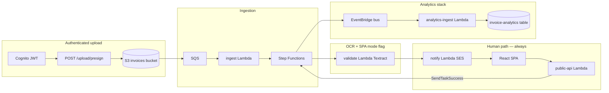

# Developer guide — invoice processing & approval

This document complements [README.md](./README.md). It explains **how the repo is organized**, **how to run and configure** it, and **why** the main design choices were made. File paths use **relative links** so they stay clickable in **VS Code** (Markdown preview: `Ctrl+Shift+V` / `Cmd+Shift+V`).

---

## Table of contents

1. [Goals and source of requirements](#goals-and-source-of-requirements)
2. [Repository map](#repository-map)
3. [CDK app entry and stack wiring](#cdk-app-entry-and-stack-wiring)
4. [Configuration layers](#configuration-layers)
5. [End-to-end runtime flow](#end-to-end-runtime-flow)
6. [Step Functions design](#step-functions-design)
7. [Security model](#security-model)
8. [DynamoDB and EventBridge contracts](#dynamodb-and-eventbridge-contracts)
9. [HTTP API and SPA](#http-api-and-spa)
10. [Operational checklist (AWS)](#operational-checklist-aws)
11. [Snippets reference](#snippets-reference)
12. [Node 20 via Docker (Windows and others)](#node-20-via-docker-windows-and-others)
13. [Testing (Vitest + mock API)](./README-test.md)

---

## Goals and source of requirements

The behaviour is driven by the product notes in **`prompts.txt`**. In short we aimed for:

- **Separation of concerns**: invoice workflow vs analytics so blast radius and redeploy scope stay smaller.
- **Managed OCR**: **Textract `AnalyzeExpense`** instead of custom OCR in Lambda — fewer moving parts and stronger invoice-oriented output.
- **Human approval always**: OCR confidence does **not** auto-approve. **`ocrConfidenceThreshold`** only selects SPA mode: **below threshold** → manual verification + approve/reject; **at/above** → trust OCR for display (automatic verification) but reviewer still must **explicitly approve or reject**.
- **Human-in-the-loop**: Step Functions **`WAIT_FOR_TASK_TOKEN`** so the workflow pauses until the reviewer completes the SPA; resume uses **`SendTaskSuccess`** with a structured payload.
- **Reliability**: SQS (+ DLQ) between S3 and workflow start, retries on Lambda invoke where appropriate, explicit timeout path for human review.
- **Observability**: Step Functions logging/tracing enabled on the state machine.

---

## Repository map

| Path | Role |
| ---- | ---- |
| [bin/invoice-app.ts](./bin/invoice-app.ts) | CDK `App`, stage + context, instantiates both stacks |
| [lib/invoice-processing-stack.ts](./lib/invoice-processing-stack.ts) | Main workflow: S3, SQS, Lambdas, Step Functions, API, Cognito |
| [lib/analytics-stack.ts](./lib/analytics-stack.ts) | Custom EventBridge bus + rule + analytics Lambda + table |
| [lib/stage-config.ts](./lib/stage-config.ts) | Merged stage config (defaults + `cdk.json` + optional `config/<stage>.json`) |
| [lambda/](./lambda/) | Runtime handlers (one folder per function entry) |
| [lambda/shared/outcomes.ts](./lambda/shared/outcomes.ts) | Shared `PutEvents` helper for invoice outcomes |
| [spa/](./spa/) | Vite + React approval UI |
| [cdk.json](./cdk.json) | CDK app command + `context.invoice.*` defaults |
| [config/example.dev.json](./config/example.dev.json) | Template for gitignored per-stage overrides |

---

## CDK app entry and stack wiring

The app reads **`stage`** from context (default **`dev`**) and merges **`invoice`** overrides from CDK context before constructing stacks.

**Why analytics first?** The invoice stack needs an **`IEventBus`** reference to grant **`PutEvents`** on the **same** bus the analytics rule listens to. The app wires [`analyticsStack.eventBus`](./bin/invoice-app.ts) into [`InvoiceProcessingStack`](./lib/invoice-processing-stack.ts) and declares a **stack dependency** so deploy order is safe.

```typescript
// bin/invoice-app.ts (excerpt)
const stage = app.node.tryGetContext("stage") ?? "dev";
const config = loadStageConfig(stage, {
  invoice: app.node.tryGetContext("invoice") as Record<string, InvoiceContextOverrides> | undefined,
});

const analyticsStack = new AnalyticsStack(app, `InvoiceAnalytics-${stage}`, { /* ... */ });
const invoiceStack = new InvoiceProcessingStack(app, `InvoiceProcessing-${stage}`, {
  analyticsEventBus: analyticsStack.eventBus,
  /* ... */
});
invoiceStack.addDependency(analyticsStack);
```

Files: [bin/invoice-app.ts](./bin/invoice-app.ts), [lib/analytics-stack.ts](./lib/analytics-stack.ts), [lib/invoice-processing-stack.ts](./lib/invoice-processing-stack.ts).

---

## Configuration layers

Configuration is merged in [`loadStageConfig`](./lib/stage-config.ts):

1. **Sensible defaults** (threshold differs by stage: prod stricter than dev).
2. **`cdk.json` → `context.invoice.<stage>`** — versioned, non-secret knobs (e.g. OCR threshold, SPA base URL hint).
3. **Optional `config/<stage>.json`** — gitignored via [config/.gitignore](./config/.gitignore); use [config/example.dev.json](./config/example.dev.json) as a template for SES addresses and recipient lists.

**Why three layers?** Repo defaults keep `cdk synth` usable without secrets; `cdk.json` documents team conventions; local JSON supports developer-specific emails and URLs without committing PII.

**SSM:** [`StageConfig.ssmParameterPrefix`](./lib/stage-config.ts) documents a **recommended namespace** (`/invoice-pipeline/<stage>`) if you later move secrets or tunables to Parameter Store and read them from Lambdas at runtime (not wired by default, to keep the baseline deploy simple).

---

## End-to-end runtime flow



1. **Upload**: JWT-protected presign ([`presign-upload`](./lambda/presign-upload/index.ts), route wired in [`invoice-processing-stack.ts`](./lib/invoice-processing-stack.ts)) returns PUT URL; client uploads file → **S3** triggers **SQS** (decoupling + back-pressure).
2. **Ingest**: [`lambda/ingest`](./lambda/ingest/index.ts) starts an execution with bucket/key and a new `invoiceId`.
3. **Validate**: [`lambda/validate`](./lambda/validate/index.ts) reads the object, runs **Textract**, writes **`invoice-records-*`**, sets **`manualVerificationRequired`** when confidence is **below** [`ocrConfidenceThreshold`](./lib/stage-config.ts) (SPA editing vs read-only).
4. **Notify + wait**: Every invoice goes through **SES** + **`WAIT_FOR_TASK_TOKEN`** (no OCR-only auto-approve).
5. **Human**: Notify stores **`reviewSessionId`** + task token fields on the invoice row and emails a link whose query string matches what [`spa/src/App.tsx`](./spa/src/App.tsx) expects (`invoiceId`, `session`). **`public-api`** validates session, then calls **`SendTaskSuccess`**.
6. **Finalize**: Lambdas [`finalize-human-approve`](./lambda/finalize-human-approve/index.ts) / [`finalize-human-reject`](./lambda/finalize-human-reject/index.ts) update DynamoDB and emit **`InvoiceOutcome`** events.
7. **Analytics**: [`lambda/analytics-ingest`](./lambda/analytics-ingest/index.ts) increments counters on the analytics table (see [EventBridge contracts](#dynamodb-and-eventbridge-contracts)).

---

## Step Functions design

Definition lives in [`lib/invoice-processing-stack.ts`](./lib/invoice-processing-stack.ts).

| Piece | Rationale |
| ----- | --------- |
| **`ValidateInvoiceTask`** with `resultPath: $.validated` | Keeps the raw execution input (bucket, key, ids) while nesting validation output for choices and notify payload. |
| **Retry on Lambda service exceptions** | Textract / Lambda transient failures get exponential backoff without failing the whole workflow immediately. |
| **No branch on OCR for “auto-approve”** | After validate, the state machine **always** continues to **notify** + **wait**; `manualVerificationRequired` is only for the **SPA** (and email copy). |
| **`WAIT_FOR_TASK_TOKEN` + `taskTimeout` (7 days)** | Standard pattern for human approval; timeout maps to a **`States.Timeout`** catch → **`Fail`** state so executions do not hang forever. |
| **Choice on `$.action` after wait** | The callback output from `SendTaskSuccess` **replaces** the state input for the next state, so branches key off flat `APPROVE` / `REJECT` strings. |
| **Finalize lambdas read `invoiceId` + DynamoDB** | We do not rely on merging large SFN state across the wait; the DB is the system of record for context. |

Pointer: chain assembly — [`validateTask` → `notifyTask` → `humanChoice`](./lib/invoice-processing-stack.ts).

---

## Security model

| Surface | Mechanism | Why |
| ------- | --------- | --- |
| **Upload presign** | **HTTP API JWT** authorizer + Cognito pool/client ([`HttpJwtAuthorizer`](./lib/invoice-processing-stack.ts)) | Only authenticated users can obtain PUT URLs; bucket stays private. |
| **Human approval API** | **No Cognito** on `/public/*`; **`invoiceId` + `session`** must match the row written during notify ([`public-api`](./lambda/public-api/index.ts)) | Approvers come from an email link; forcing Cognito login there would add friction; **session id** is the capability token for that review. |
| **Step Functions task token** | Stored server-side on the invoice record; never placed in the email URL | Reduces leak risk vs embedding the raw task token in query strings. |
| **IAM** | `states:SendTaskSuccess` scoped in practice to completing human steps ([policy on `publicApiFn`](./lib/invoice-processing-stack.ts)) | Required for the callback pattern from API Gateway Lambda. |

---

## DynamoDB and EventBridge contracts

**Invoices table** (`invoice-records-<stage>`): partition key **`invoiceId`**. Notable attributes include status lifecycle (`PENDING_HUMAN_APPROVAL` → `AWAITING_HUMAN` → …), **`manualVerificationRequired`**, `reviewSessionId`, `taskToken` (while waiting), and serialized OCR payload. See [`lambda/validate`](./lambda/validate/index.ts), [`lambda/notify-human`](./lambda/notify-human/index.ts), [`lambda/public-api`](./lambda/public-api/index.ts).

**Analytics table** (`invoice-analytics-<stage>`): composite key **`pk` / `sk`**. Ingest Lambda increments **`autoApproved` / `approved` / `rejected`** on totals and per-day keys. See [`lambda/analytics-ingest/index.ts`](./lambda/analytics-ingest/index.ts).

**EventBridge**: source **`invoice.processing`**, detail-type **`InvoiceOutcome`**, emitted from [`lambda/shared/outcomes.ts`](./lambda/shared/outcomes.ts), matched by the rule in [`lib/analytics-stack.ts`](./lib/analytics-stack.ts).

---

## HTTP API and SPA

| Route | Auth | Handler |
| ----- | ---- | ------- |
| `GET /public/invoice/{invoiceId}` | Public (session query validates) | [`lambda/public-api`](./lambda/public-api/index.ts) |
| `POST /public/decision` | Public (session + task token in DB) | same |
| `POST /upload/presign` | **JWT (Cognito)** on **`dev` / `test` / `prod`**. On **`stage=local`** only: header **`x-presign-local-secret`** (shared secret from CDK/config — HTTP JWT authorizer omitted for LocalStack compatibility). | [`lambda/presign-upload`](./lambda/presign-upload/index.ts) |

**SPA**: [`spa/src/App.tsx`](./spa/src/App.tsx) reads `invoiceId` and `session` from the query string and uses **`import.meta.env.VITE_API_BASE_URL`** as the API prefix (or the **`apiBase`** query parameter — see **[local-e2e-userguide.md](./local-e2e-userguide.md)**).

### Local SPA — choose backend

Use **[spa/.env.example](./spa/.env.example)** as a template (`copy` to **`spa/.env.local`**). Typical progression:

1. **Prepare monolith** (sibling repo **`aws_cdk_invoice_processing_and_approval_prepare`**, pure Node mocks): `VITE_API_BASE_URL=http://127.0.0.1:3333`
2. **LocalStack** (`stage=local`): paste **`HttpApiUrl`** from **`npm run deploy:local`**
3. **AWS**: paste the deployed HTTP API URL from CDK outputs

```bash
cd spa
npm install
set VITE_API_BASE_URL=https://xxxx.execute-api....amazonaws.com   # Windows CMD — AWS example
npm run dev
```

```powershell
$env:VITE_API_BASE_URL = "http://127.0.0.1:3333"   # prepare monolith
npm run dev
```

**CORS** on the HTTP API is open for dev (`allowOrigins: ["*"]` in [`invoice-processing-stack.ts`](./lib/invoice-processing-stack.ts)); tighten for production (specific SPA origin + credentials policy if you add cookies).

### SPA hosting at deploy time (`SPA_HOSTING`)

| Mode | How | Review email links (`SPA_BASE_URL`) |
| ---- | --- | ------------------------------------- |
| **`skip`** (default) | Manual: Vite dev, your own host, or later S3+CloudFront | **`spaBaseUrl`** in `cdk.json` / `config/<stage>.json` |
| **`lambda`** | Lambda **function URL** serves built `spa/dist` | Auto: **`SpaLambdaFunctionUrl`** output (overrides config for notify Lambda) |
| **`ec2`** | S3 artifact bucket + sync to nginx | **`spaBaseUrl`** must be your public nginx URL |

Set via environment (wins) or CDK context in [`cdk.json`](./cdk.json) (`spaHosting`):

```powershell
# Manual host (fast API-only deploy; same as today)
$env:SPA_HOSTING = "skip"
npm run deploy:dev

# Lambda function URL (cheaper than CloudFront while experimenting)
# 1) Put HttpApiUrl in spa/.env.dev, then:
npm run spa:build:dev
$env:SPA_HOSTING = "lambda"
npm run deploy:dev -- --require-approval never
# Open SpaLambdaFunctionUrl; API calls use VITE_API_BASE_URL baked at build time.
```

| Build script | Env file |
| ------------ | -------- |
| **`npm run spa:build:dev`** | **`spa/.env.dev`** |
| **`npm run spa:build:test`** | **`spa/.env.test`** |
| **`npm run spa:build:prod`** | **`spa/.env.prod`** |

Implementation: [`lib/resolve-spa-hosting.ts`](./lib/resolve-spa-hosting.ts), [`lib/spa-hosting-construct.ts`](./lib/spa-hosting-construct.ts), [`lib/spa-local-bundle.ts`](./lib/spa-local-bundle.ts), [`lambda/spa-static-host/handler.cjs`](./lambda/spa-static-host/handler.cjs).

**Synth note:** With **`SPA_HOSTING=lambda`** or **`ec2`**, run **`npm run spa:build:<stage>`** first. CDK copies **`spa/dist`** on the host only (no Docker). Synth/deploy **fails** if **`spa/dist`** is missing.

---

## Operational checklist (AWS)

- **SES**: Verify sender (`sesFromAddress`) and recipients if still in **sandbox**; production sending may need moving out of sandbox.
- **Cognito**: Create test users (password/SRP enabled on the app client) to call **`/upload/presign`**.
- **Textract + S3**: Lambdas use IAM permissions already attached in the stack; large PDFs may need async Textract in a future iteration (current code uses synchronous `AnalyzeExpense` on downloaded bytes).
- **Quotas**: Step Functions open executions, SQS visibility, and API Gateway limits apply under load.

---

## Snippets reference

### CDK: human notify + task token payload

From [`lib/invoice-processing-stack.ts`](./lib/invoice-processing-stack.ts):

```typescript
const notifyTask = new tasks.LambdaInvoke(this, "NotifyHumanTask", {
  lambdaFunction: notifyFn,
  integrationPattern: sfn.IntegrationPattern.WAIT_FOR_TASK_TOKEN,
  payload: sfn.TaskInput.fromObject({
    "bucket.$": "$.validated.bucket",
    "key.$": "$.validated.key",
    "invoiceId.$": "$.validated.invoiceId",
    "stage.$": "$.validated.stage",
    "minConfidence.$": "$.validated.minConfidence",
    "manualVerificationRequired.$": "$.validated.manualVerificationRequired",
    "taskToken.$": "$$.Task.Token",
  }),
  taskTimeout: sfn.Timeout.duration(cdk.Duration.days(7)),
});
```

### Lambda: resume workflow from API

From [`lambda/public-api/index.ts`](./lambda/public-api/index.ts):

```typescript
await sfn.send(
  new SendTaskSuccessCommand({
    taskToken: token,
    output: JSON.stringify(output),
  }),
);
```

### Emit analytics event

From [`lambda/shared/outcomes.ts`](./lambda/shared/outcomes.ts):

```typescript
await eb.send(
  new PutEventsCommand({
    Entries: [
      {
        EventBusName: params.eventBusName,
        Source: "invoice.processing",
        DetailType: "InvoiceOutcome",
        Detail: JSON.stringify({
          invoiceId: params.invoiceId,
          outcome: params.outcome,
          stage: params.stage,
          reason: params.reason,
          ts: new Date().toISOString(),
        }),
      },
    ],
  }),
);
```

---

## Node / toolchain

This repo is **host-first**: use **Node 20+** (recommended: **Node 22**) and run CDK/Playwright directly from the host.

---

## Related reading

- [README.md](./README.md) — short overview and quick start  
- [package.json](./package.json) — scripts (`deploy:dev`, `synth`, `spa:build`)
- [cdk.json](./cdk.json) — `context.invoice` defaults per stage  
